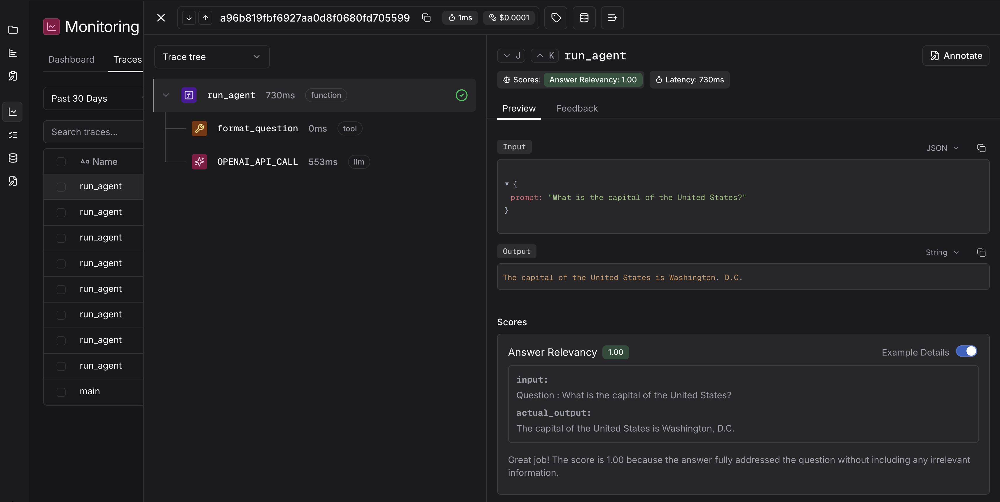
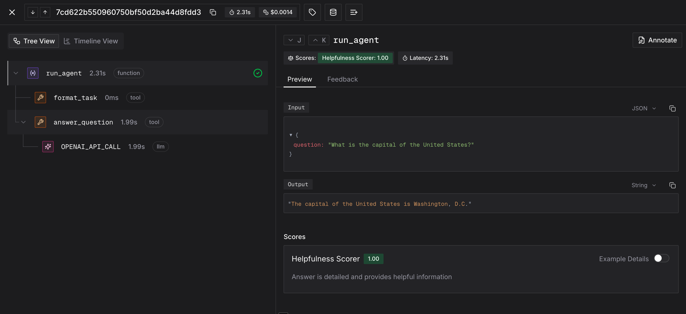

<div align="center">

<a href="https://judgmentlabs.ai/">
  <picture>
    <source media="(prefers-color-scheme: dark)" srcset="assets/logo_darkmode.svg">
    
  </picture>
</a>

<br>

## Agent Behavior Monitoring

Track and judge agent behavior in online and offline setups. Set up Sentry-style alerts and analyze agent behaviors at scale.

[](https://pypi.org/project/judgeval/)
[](https://docs.judgmentlabs.ai/documentation)
[](https://app.judgmentlabs.ai/register)
[](https://docs.judgmentlabs.ai/documentation/self-hosting/get-started)

[](https://x.com/JudgmentLabs)
[](https://www.linkedin.com/company/judgmentlabs)

</div>

## Overview

Judgeval is an open-source Python SDK for agent behavior monitoring. It provides tracing, evaluation, and online monitoring for LLM-powered applications, enabling you to catch failures in real time and improve agents from production data.

To get started, try one of the [cookbooks](#cookbooks) below or dive into the [docs](https://docs.judgmentlabs.ai/documentation).

## Why Judgeval

**OpenTelemetry-based tracing** -- Instrument any function with `@Tracer.observe()`. Automatically captures inputs, outputs, and LLM token usage. Built on OpenTelemetry for full compatibility with existing observability stacks.

**Hosted and custom evaluation** -- Run evaluations against Judgment's hosted scorers (faithfulness, answer relevancy, instruction adherence, etc.) or define your own `Judge` classes with binary, numeric, or categorical response types.

**Online monitoring** -- Score live production traffic asynchronously with `Tracer.async_evaluate()`. Runs server-side with no latency impact. Configure Slack alerts for failures.

**Custom scorer hosting** -- Upload arbitrary Python scorers to run in secure Firecracker microVMs. Any logic you can express in Python -- LLM-as-a-judge, code checks, multi-step pipelines -- can run as a hosted scorer.

**Dataset management and prompt versioning** -- Store golden evaluation sets, version prompt templates with `{{variable}}` syntax, and tag versions for production/staging workflows.

**Broad integrations** -- Auto-instrumentation for OpenAI, Anthropic, Google GenAI, and Together AI. Framework support for LangGraph, OpenLit, and Claude Agent SDK.

## Quickstart

Install the SDK:

```bash
pip install judgeval
```

Set your credentials ([create a free account](https://app.judgmentlabs.ai/register) if you don't have keys):

```bash
export JUDGMENT_API_KEY=...
export JUDGMENT_ORG_ID=...
```

### Tracing

Add observability to your agent with two lines of setup:

```python
from judgeval import Tracer, wrap
from openai import OpenAI

Tracer.init(project_name="my-project")
client = wrap(OpenAI())

@Tracer.observe(span_type="tool")
def search(query: str) -> str:
    results = vector_db.search(query)
    return results

@Tracer.observe(span_type="agent")
def run_agent(question: str) -> str:
    context = search(question)
    response = client.chat.completions.create(
        model="gpt-4o-mini",
        messages=[{"role": "user", "content": f"{context}\n\n{question}"}],
    )
    return response.choices[0].message.content

run_agent("What is the capital of the United States?")
```

All traces are delivered to your [Judgment dashboard](https://app.judgmentlabs.ai/):



### Online Monitoring

Score live traffic asynchronously inside any traced function. Evaluations run server-side after the span completes:

```python
@Tracer.observe(span_type="agent")
def run_agent(question: str) -> str:
    response = client.chat.completions.create(
        model="gpt-4o-mini",
        messages=[{"role": "user", "content": question}],
    )
    answer = response.choices[0].message.content

    Tracer.async_evaluate(
        "answer_relevancy",
        {"input": question, "actual_output": answer},
    )

    return answer
```



### Offline Evaluation

Use the `Judgeval` client to run batch evaluations against hosted scorers:

```python
from judgeval import Judgeval
from judgeval.data import Example

client = Judgeval(project_name="my-project")
evaluation = client.evaluation.create()

results = evaluation.run(
    examples=[
        Example.create(
            input="What is 2+2?",
            actual_output="4",
            expected_output="4",
        ),
    ],
    scorers=["faithfulness", "answer_relevancy"],
    eval_run_name="nightly-eval",
)
```

Results are returned as `ScoringResult` objects and displayed in the dashboard.

## Custom Judges

Define your own evaluation logic by subclassing `Judge` with a response type:

```python
from judgeval.judges import Judge
from judgeval.hosted.responses import BinaryResponse
from judgeval.data import Example

class CorrectnessJudge(Judge[BinaryResponse]):
    async def score(self, data: Example) -> BinaryResponse:
        correct = data["expected_output"].lower() in data["actual_output"].lower()
        return BinaryResponse(
            value=correct,
            reason="Contains expected answer" if correct else "Missing expected answer",
        )
```

Three response types are available:

| Type | Value | Use case |
|:-----|:------|:---------|
| `BinaryResponse` | `bool` | Pass/fail checks |
| `NumericResponse` | `float` | Continuous scores (0.0 -- 1.0) |
| `CategoricalResponse` | `str` | Classification into defined categories |

### Scaffold and upload via CLI

```bash
judgeval scorer init -t binary -n CorrectnessJudge
judgeval scorer upload correctness_judge.py -p my-project
```

Once uploaded, your judge runs in a secure Firecracker microVM and can be used with `Tracer.async_evaluate()` for online monitoring.

## Datasets

Manage golden evaluation sets through the platform:

```python
from judgeval import Judgeval
from judgeval.data import Example

client = Judgeval(project_name="my-project")

dataset = client.datasets.create(
    name="golden-set",
    examples=[
        Example.create(input="What is 2+2?", expected_output="4"),
        Example.create(input="Capital of France?", expected_output="Paris"),
    ],
)

dataset = client.datasets.get(name="golden-set")
```

Datasets support import from JSON/YAML, batch appending, and export.

## Prompt Versioning

Version and tag prompt templates with `{{variable}}` placeholders:

```python
client = Judgeval(project_name="my-project")

prompt = client.prompts.create(
    name="system-prompt",
    prompt="You are a helpful assistant for {{product}}. Answer in {{language}}.",
    tags=["production"],
)

prompt = client.prompts.get(name="system-prompt", tag="production")
compiled = prompt.compile(product="Acme Search", language="English")
```

## Integrations

### LLM Providers

Wrap any supported client with `wrap()` for automatic span creation and token/cost tracking:

```python
from judgeval import wrap

client = wrap(OpenAI())          # OpenAI
client = wrap(Anthropic())       # Anthropic
client = wrap(genai.Client())    # Google GenAI
client = wrap(Together())        # Together AI
```

### Frameworks

| Framework | Setup |
|:----------|:------|
| LangGraph | `from judgeval.integrations import Langgraph; Langgraph.initialize()` |
| OpenLit | `from judgeval.integrations import Openlit; Openlit.initialize()` |
| Claude Agent SDK | `from judgeval.integrations import setup_claude_agent_sdk; setup_claude_agent_sdk()` |

## Cookbooks

| Topic | Notebook | Description |
|:------|:---------|:------------|
| Online ABM | [Research Agent](https://colab.research.google.com/github/JudgmentLabs/judgment-cookbook/blob/main/monitoring/Research_Agent_Online_Monitoring.ipynb) | Monitor agent behavior in production |
| Custom Scorers | [HumanEval](https://colab.research.google.com/github/JudgmentLabs/judgment-cookbook/blob/main/custom_scorers/HumanEval_Custom_Scorer.ipynb) | Build custom evaluators for your agents |

Browse the full [cookbook repository](https://github.com/JudgmentLabs/judgment-cookbook) or watch [video tutorials](https://www.youtube.com/@Alexshander-JL).

## Links

- [Documentation](https://docs.judgmentlabs.ai/documentation)
- [Judgment Platform](https://app.judgmentlabs.ai/)
- [Self-Hosting Guide](https://docs.judgmentlabs.ai/documentation/self-hosting/get-started)
- [Custom Scorers Guide](https://docs.judgmentlabs.ai/documentation/evaluation/custom-scorers)
- [Online Evaluation Guide](https://docs.judgmentlabs.ai/documentation/performance/online-evals)
- [Cookbook Repository](https://github.com/JudgmentLabs/judgment-cookbook)
- [Video Tutorials](https://www.youtube.com/@Alexshander-JL)

---

Judgeval is created and maintained by [Judgment Labs](https://judgmentlabs.ai/).
